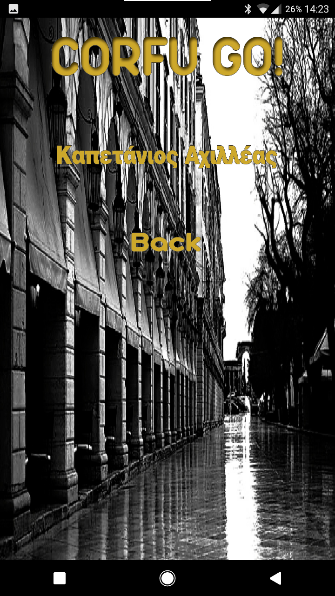
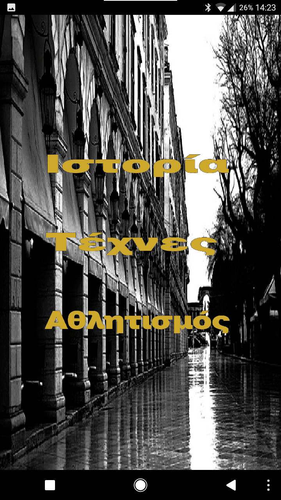
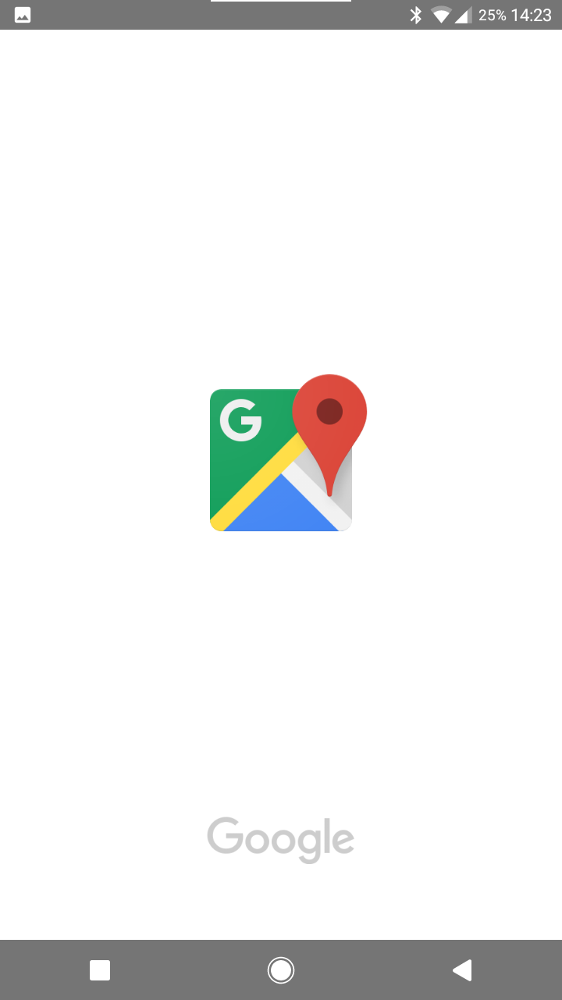
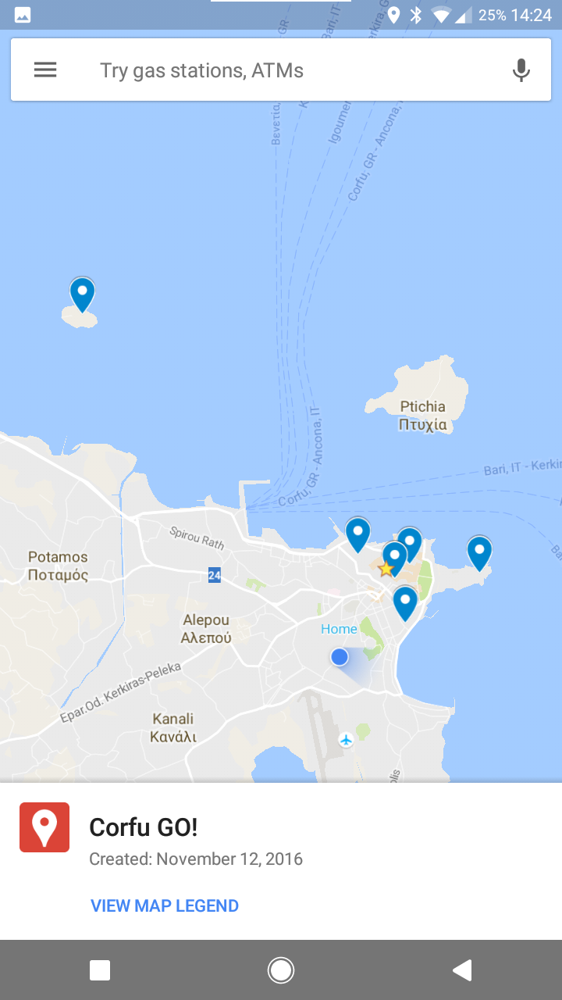
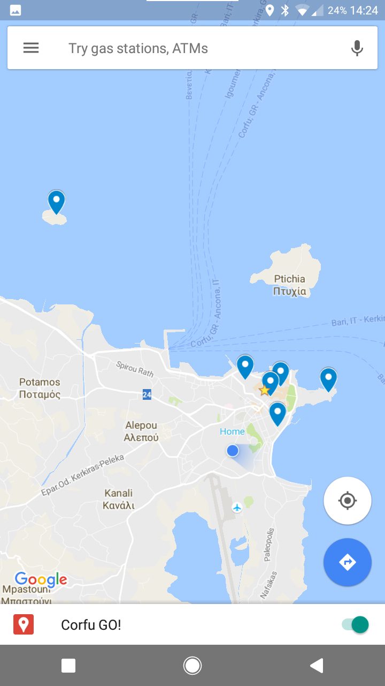
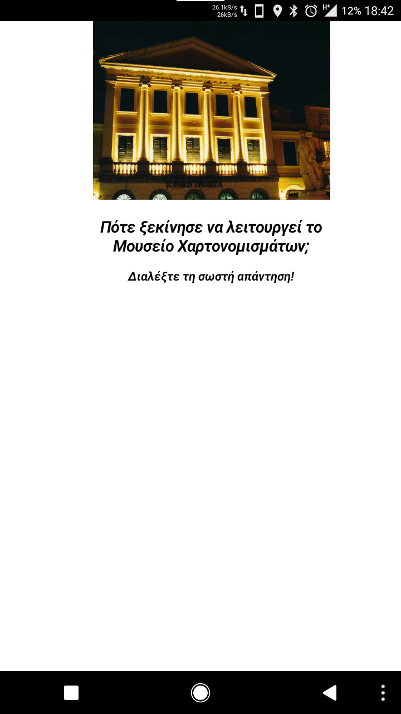
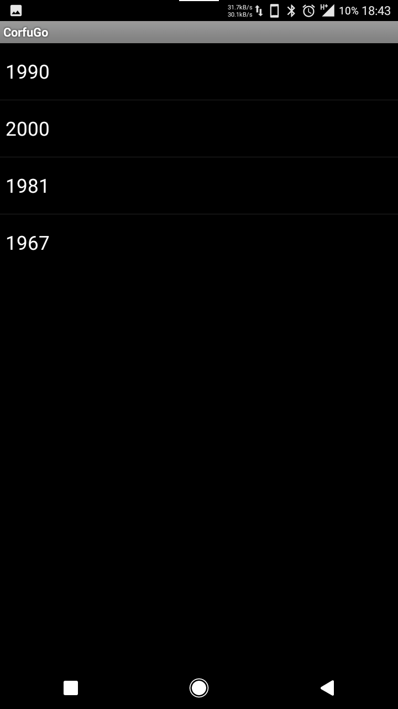
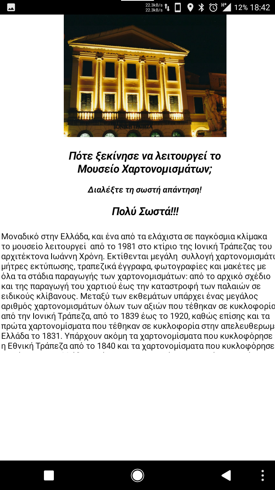
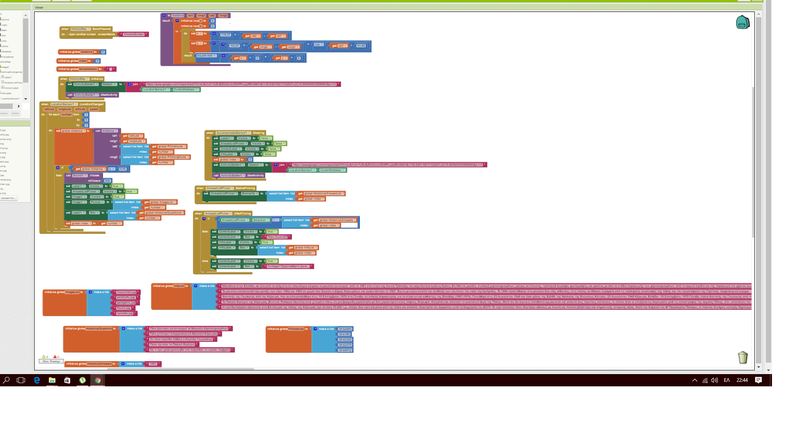

#ΙΟΝΙΟ ΠΑΝΕΠΙΣΤΗΜΙΟ 
#ΤΜΗΜΑ ΠΛΗΡΟΦΟΡΙΚΗΣ 
#ΜΑΘΗΜΑ: Επικοινωνία Ανθρώπου-Υπολογιστή 
 
Επιβλέπων καθηγητής: Χωριανόπουλος Κωνσταντίνος 

Καπετάνιος Αχιλλέας  ΑΜ: Π2015201     p15kape1@ionio.gr

# Τίτλος

## Εφαρμογή για κινητά Corfu Go!

##Σύνοψη

* Είναι ένα εύχρηστο παιχνίδι γνώσεων που εκμεταλλεύεται τις δυνατότητες μιας κινητής συσκευής (κινητό ή τάμπλετ) και τις συνήθειες μαθητών ή τουριστών να γνωρίσουν μία πόλη από κοντά, περπατώντας την.
* Είναι μια εφαρμογή εναλλακτικής πραγματικότητας, που από τη μία έχει προκαθορισμένα στο χάρτη τα διάφορα σημεία ενδιαφέροντος με σκοπό να υποδείξει στο χρήστη την τοποθεσία τους και να τον καθοδηγήσει 
για το πώς να πάει σε αυτά και από την άλλη, μέσα από τη διαδικασία των ερωτήσεων, παρέχει διάφορες χρήσιμες πληροφορίες για το καθένα από αυτά.
* Απευθύνεται σε όλους όσους έχουν κινητή συσκευή Android, αλλά κυρίως σε μαθητές Γυμνασίου - Λυκείου και σε Έλληνες τουρίστες που θέλουν να γνωρίσουν την πόλη της Κέρκυρας.

##Εισαγωγή

###Προδιαγραφές

####Άνθρωπος

Μαθητές Γυμνασίου - Λυκείου, Ενήλικες

####Πλαίσιο Χρήσης - Σκοπός
* Παιχνίδι Γνώσεων
* Γνωριμία με την Ιστορία της πόλης της Κέρκυρας, τον πολιτισμό, τους ανθρώπους
* Εφαρμογή κινητής συσκευής, κουίζ γνώσεων με ερωτήσεις που εμφανίζονται μόλις ο χρήστης βρεθεί σε προκαθορισμένες συντεταγμένες στο χάρτη.

####Λόγοι επιτυχίας

* Ενημέρωση για τα ιστορικά και πολιτιστικά αξιοθέατα της πόλης και χάρτης για την τοποθεσία τους.
* Παροχή πληροφοριών για το κάθε αξιοθέατο.
* Γνωρίζοντας την πόλη μέσω παιχνιδιού.

## Εγκατάσταση εργαλείων ανάπτυξης

* Εργαλείο ανάπτυξης: MIT App Inventor
* Adobe inDesign (για την αισθητική βελτίωση της εφαρμογής)
* My Maps για τη δημιουργία χαρτών στο Google Maps

## Δανεισμός στοιχείων (ιδέες και κώδικα) από:
* http://www.appinventor.org/content/ai2apps/intermediateApps/presidentsQuiz
  Δανεισμός κώδικα για τη δημιουργία των ερωτήσεων και των απαντήσεων

* http://explore.appinventor.mit.edu/ai2/android-wheres-my-car
  Δανεισμός κώδικα για την εκκίνηση του Google Maps και γενικά τη λειτουργία του αισθητήρα τοποθεσίας

* http://appinventor.mit.edu/explore/displaying-maps.html
  Δανεισμός κώδικα για την εκκίνηση του Google Maps και γενικά τη λειτουργία του αισθητήρα τοποθεσίας

* http://www.appinventor.org/content/howDoYou/location/distance
  Κώδικας για την εύρεση της ευκλείδιας απόστασης

* Where is my bus (εφαρμογή μαθητών σχολείων Κέρκυρας)
  Για την αισθητική βελτίωση της εφαρμογής αλλά και ιδέες για τον κώδικα του αισθητήρα απόστασης

## Βελτιώσεις στη Τελική Παρουσίαση

* Υπήρξε σημαντική βελτίωση στην αισθητική της εφαρμογής με τη χρήση του inDesign για τη σχεδίαση των κουμπιών. 
* Μία δυσκολία με τη λειτουργία της εφαρμογής που ξεπεράστηκε, είναι η χρήση συντεταγμένων, όχι με ακρίβεια σημείου αλλά με εύρος κάποιας περιοχής γύρω από το σημείο, ώστε η ερώτηση ενεργοποιείται ακόμα κι αν ο χρήστης είναι κοντά και όχι ακριβώς πάνω στο αποθηκευμένο σημείο του χάρτη.
Αυτό έγινε υπολογίζοντας την Ευκλείδια απόσταση και βάζοντας σαν προϋπόθεση ενεργοποίησης της ερώτησης να είναι αυτή η απόσταση μικρότερη των 50 μέτρων από το ήδη αποθηκευμένο σημείο στο χάρτη.
Για να βρούμε την Ευκλείδια απόσταση έπρεπε πρώτα να μετατρέψουμε τις συντεταγμένες που παίρνουμε από το χάρτη σε χιλιομετρικές αποστάσεις για το γεωγραφικό μήκος και πλάτος και μετά να υπολογίσουμε την απόσταση.
* Προστέθηκαν επίσης φωτογραφίες για κάθε μέρος, που εμφανίζονται πάνω από την ερώτηση καθώς και πληροφορίες για κάθε μέρος που εμφανίζονται μόλις ο χρήστης απαντήσει σωστά.

##Διαδικασία ανάπτυξης

* Ενδεικτικό GUI ώστε πάνω του να στηθεί η εφαρμογή. Το αισθητικό αποτέλεσμα αφέθηκε για το τέλος.
* Κώδικας που περιλαμβάνει τις ερωτήσεις, τις πιθανές απαντήσεις, τις σωστές απαντήσεις
* Κώδικας που εμφανίζει την ερώτηση και τις πιθανές απαντήσεις
* Δημιουργία στο My Maps της Google του χάρτη με όλα τα σημεία ενδιαφέροντος
* Κώδικας που κρατάει σε λίστα τις συντεταγμένες όλων των σημείων ενδιαφέροντος που έχουμε βάλει στο χάρτη.
* Κώδικας που ξεκινάει την εφαρμογή Google Maps, φορτώνει το χάρτη που έχουμε φτιάξει, και συγκρίνει τη θέση μας με τα αποθηκευμένα στο   χάρτη σημεία προκειμένου να εμφανίσει την ανάλογη ερώτηση.
* Κώδικας για την εύρεση της Ευκλείδιας απόστασης και θέτοντας αυτήν ως προϋπόθεση για την εμφάνιση της ερώτησης.
* Αισθητική βελτιστοποίηση της εφαρμογής.
* Προσθήκη φωτογραφιών και πληροφοριών για κάθε τοποθεσία. Κώδικας για δόνηση της συσκευής κάθε φορά που ο χρήστης βρίσκεται σε ένα από * τα επιλεγμένα σημεία και εμφανίζεται η ερώτηση. 

##Περιγραφή Εφαρμογής Corfu GO!

* Παιχνίδι γνώσεων που απευθύνεται κυρίως σε μαθητές γυμνασίου - λυκείου κι έχει σκοπό να να βοηθήσει τους μαθητές να μαθουν - μέσα από ένα παιχνίδι ερωτήσεων- περισσότερα για 
την πόλη τους, την Κέρκυρα, την ιστορία της, τον πολιτισμό της, τους ανθρώπους της, την κοινωνική ζωή της.
* Απευθύνεται και σε ενήλικες, ντόπιους και τουρίστες (προς το παρόν Έλληνες τουρίστες), βοηθώντας τους να μάθουν τα τοπικά σημεία ενδιαφέροντος, για κάθε θέμα, απαντώντας σε απλές 
ερωτήσεις και μαθαίνοντας πληροφορίες για κάθε μέρος που επισκέπτονται.
* Η εφαρμογή είναι κουίζ ερωτήσεων που βασίζεται στην περιήγηση του χρήστη στην πόλη της Κέρκυρας. Αφου ανοίξει την εφαρμογή κι επιλέξει κατηγορία ερωτήσεων, μέσω του χάρτη που εμφανίζεται 
στην οθόνη της κινητής συσκευής, κατευθύνεται προς διάφορα προεπιλεγμένα σημεία που έχουν σχέση με την κατηγορία ερωτήσεων που διάλεξε. Μόλις φτάσει στο σημείο, η συσκευή δονείται, εμφανίζεται ενα pop-up στην 
κινητή συσκευή με μία ερώτηση για το σημείο που βρίσκεται, τη φωτογραφία, κι ένα κουμπί που προτρέπει το χρήστη να διαλέξει μία απάντηση. Μόλις το πατήσει εμφανίζονται 4 απαντήσεις από τις οποίες πρέπει να επιλέξει τη σωστή. Αφού επιλέξει, εμφανίζεται ένα μήνυμα επιβεβαίωσης ή λάθους και με shake
στην κινητή συσκευή φεύγει το pop-up και συνεχίζεται η περιήγηση στην πόλη. Μαζί με το μήνυμα επιβεβαίωσης εμφανίζονται και διάφορες χρήσιμες πληροφορίες για το μέρος αυτό.

##Βήμα - Βήμα Περιγραφή

* Μόλις ανοίξει η εφαρμογή εμφανίζεται η αρχική οθόνη, όπου επιλέγεις αν θα παίξεις ή αν θα δεις τους συντελεστές της εφαρμογής

* Η οθόνη με τους συντελεστές της εφαρμογής.

* Αν πατήσουμε play μας βγάζει την οθόνη επιλογής της κατηγορίας ερωτήσεων που θα παίξουμε. Προς το παρόν είναι Ιστορία, Τέχνες, Αθλητισμός.

* Πατώντας Ιστορία ξεκινάει η εφαρμογή Google Maps με φορτωμένο πάνω το χάρτη για το Corfu GO!. Με τα επιλεγμένα σημεία ήδη τοποθετημένα πάνω στο χάρτη.

* Μόλις ο χρήστης βρεθεί σε ένα από τα επιλεγμένα σημεία (υπολογίζοντας την απόσταση του χρήστη από το αποθηκευμένο σημείο πάνω στο χάρτη) τότε η συσκευή δονείται και εμφανίζεται μια ερώτηση σε σχέση με το σημείο αυτό, καθώς και μια φωτογραφία του σημείου αυτού.

* Πατώντας το κουμπί "Διαλέξτε τη σωστή απάντηση"  δίνεται στο χρήστη η δυνατότητα να επιλέξει μία από τις τέσσερις απαντήσεις.

* Ανάλογα με το αν απαντήσει σωστά ή λάθος θα εμφανιστεί και το ανάλογο μήνυμα. Δίνοντας τη σωστή απάντηση εμφανίζονται και γενικές πληροφορίες για το μέρος που επισκέφτηκε ο χρήστης.

 

* Κουνώντας έντονα τη συσκευή η ερώτηση εξαφανίζεται και συνεχίζεται η περιήγηση μέχρι το επόμενο σημείο.

* Παρατίθεται κι ένα βίντεο με τη λειτουργία της εφαρμογής.
  https://www.youtube.com/watch?v=rULFU3YEwYM&feature=youtu.be
  
* Παρατίθεται επίσης και μια ενδεικτική εικόνα από τον κώδικα στο App Inventor.

## Προβλήματα και μελλοντικές βελτιώσεις

* Η αισθητική της όλης εφαρμογής μπορεί να βελτιωθεί κι άλλο ειδικά με το σχεδιασμό των κουμπιών. Μια άλλη σημαντική βελτίωση μπορεί να είναι το παράθυρο της ερώτησης να είναι πιο μικρό και να φαίνεται από πίσω ο χάρτης. Να είναι δηλαδή ένα πραγματικά pop-up παράθυρο
* Λόγω bug του App Inventor δεν ήταν δυνατή η προσθήκη εικονιδίου της εφαρμογής για το συρτάρι εφαρμογών του Android. Το App Inventor κράσαρε κάθε φορά που γινόταν η προσπάθεια να φτιαχτεί το apk της εφαρμογής. Υπάρχει στον κώδικα, αλλά δεν υπάρχει η δυνατότητα να περάσει στην πραγματική εφαρμογή, ζήτημα που πρέπει να λυθεί στο μέλλον. Το icon της εφαρμογής θα ήταν το παρακάτω.

##  Online Demo (WIP): ai2.appinventor.mit.edu/?galleryId=6637166009253888

