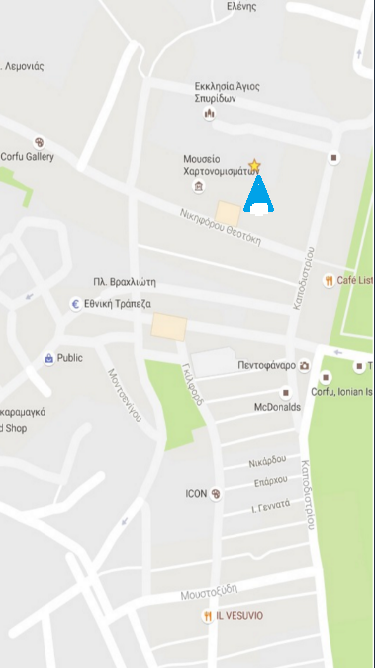
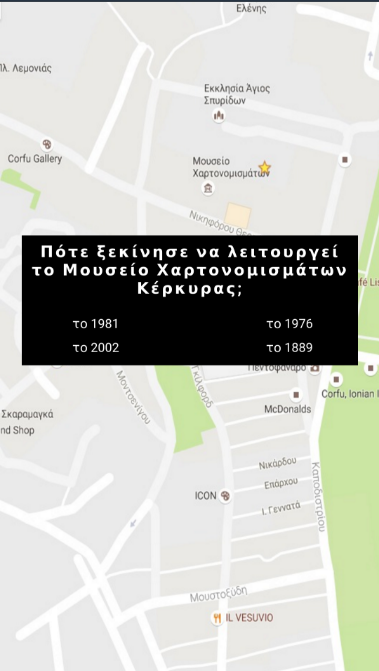
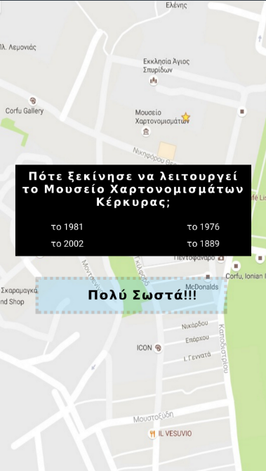

#ΙΟΝΙΟ ΠΑΝΕΠΙΣΤΗΜΙΟ 
#ΤΜΗΜΑ ΠΛΗΡΟΦΟΡΙΚΗΣ 
#ΜΑΘΗΜΑ: Επικοινωνία Ανθρώπου-Υπολογιστή 
 
Επιβλέπων καθηγητής: Χωριανόπουλος Κωνσταντίνος 

Καπετάνιος Αχιλλέας  ΑΜ: Π2015201     p15kape1@ionio.gr

##Προδιαγραφές

* Μαθητές Γυμνασίου - Λυκείου, Ενήλικες
* Παιχνίδι Γνώσεων
* Γνωριμία με την Ιστορία της πόλης της Κέρκυρας, τον πολιτισμό, τους ανθρώπους
* Εφαρμογή κινητής συσκευής, κουίζ γνώσεων με ερωτήσεις που εμφανίζονται μόλις ο χρήστης βρεθεί σε προκαθορισμένες συντεταγμένες στο χάρτη.
* Λόγοι επιτυχίας ή αποτυχίας εφαρμογών

## Εγκατάσταση εργαλείων ανάπτυξης

* Εργαλείο ανάπτυξης: MIT App Inventor

## Δανεισμός στοιχείων (ιδέες και κώδικα) από:
* http://www.appinventor.org/content/ai2apps/intermediateApps/presidentsQuiz
* http://explore.appinventor.mit.edu/ai2/android-wheres-my-car

##Περιγραφή Εφαρμογής Corfu GO!

* Παιχνίδι γνώσεων που απευθύνεται κυρίως σε μαθητές γυμνασίου - λυκείου κι έχει σκοπό να να βοηθήσει τους μαθητές να μαθουν - μέσα από ένα παιχνίδι ερωτήσεων- περισσότερα για 
την πόλη τους, την Κέρκυρα, την ιστορία της, τον πολιτισμό της, τους ανθρώπους της, την κοινωνική ζωή της.
* Απευθύνεται και σε ενήλικες, ντόπιους και τουρίστες (προς το παρόν Έλληνες τουρίστες), βοηθώντας τους να μάθουν τα τοπικά σημεία ενδιαφέροντος, για κάθε θέμα, απαντώντας σε απλές 
ερωτήσεις και μαθαίνοντας πληροφορίες για κάθε μέρος που επισκέπτονται.
* Η εφαρμογή είναι κουίζ ερωτήσεων που βασίζεται στην περιήγηση του χρήστη στην πόλη της Κέρκυρας. Αφου ανοίξει την εφαρμογή κι επιλέξει κατηγορία ερωτήσεων, μέσω του χάρτη που εμφανίζεται 
στην οθόνη της κινητής συσκευής, κατευθύνεται προς διάφορα προεπιλεγμένα σημεία που έχουν σχέση με την κατηγορία ερωτήσεων που διάλεξε. Μόλις φτάσει στο σημείο, εμφανίζεται ενα pop-up στην 
κινητή συσκευή με μία ερώτηση για το σημείο που βρίσκεται και 4 απαντήσεις από τις οποίες πρέπει να επιλέξει τη σωστή. Αφού επιλέξει, εμφανίζεται ένα μήνυμα επιβεβαίωσης ή λάθους και με shake
στην κινητή συσκευή φεύγει το pop-up και συνεχίζεται η περιήγηση στην πόλη.

##  Online Demo: ai2.appinventor.mit.edu/?galleryId=6398350346420224

