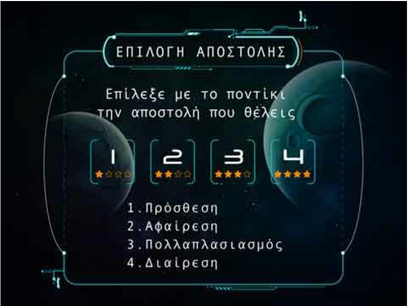
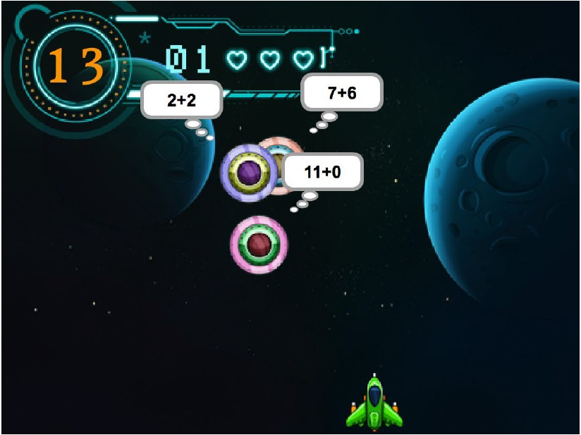
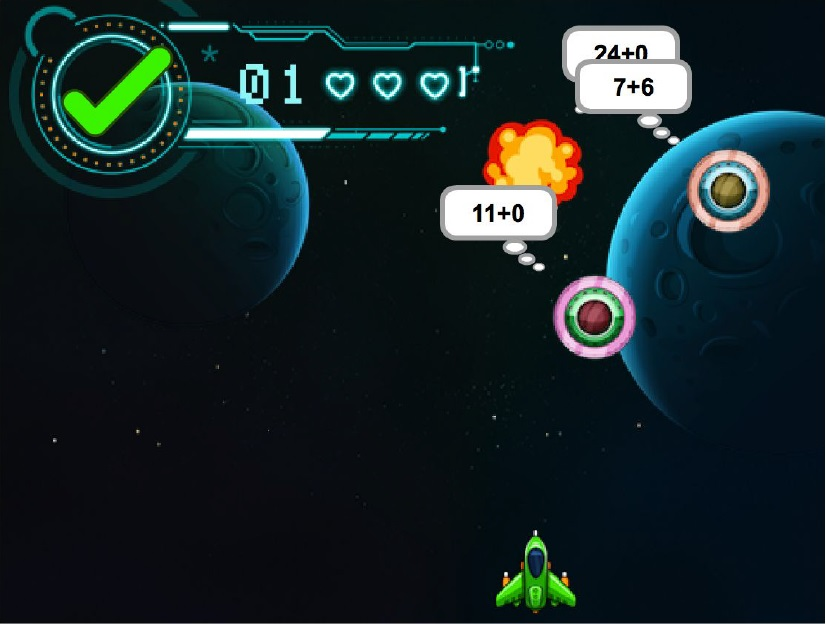
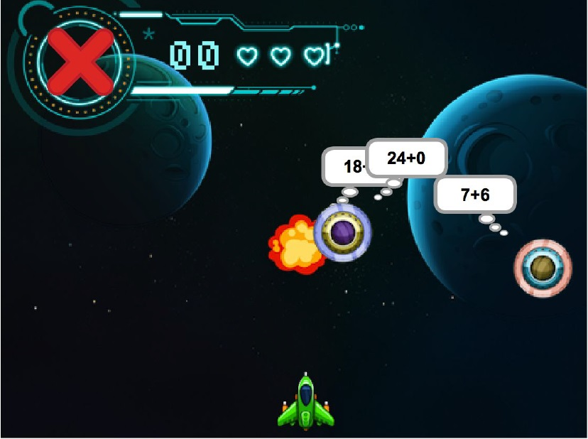
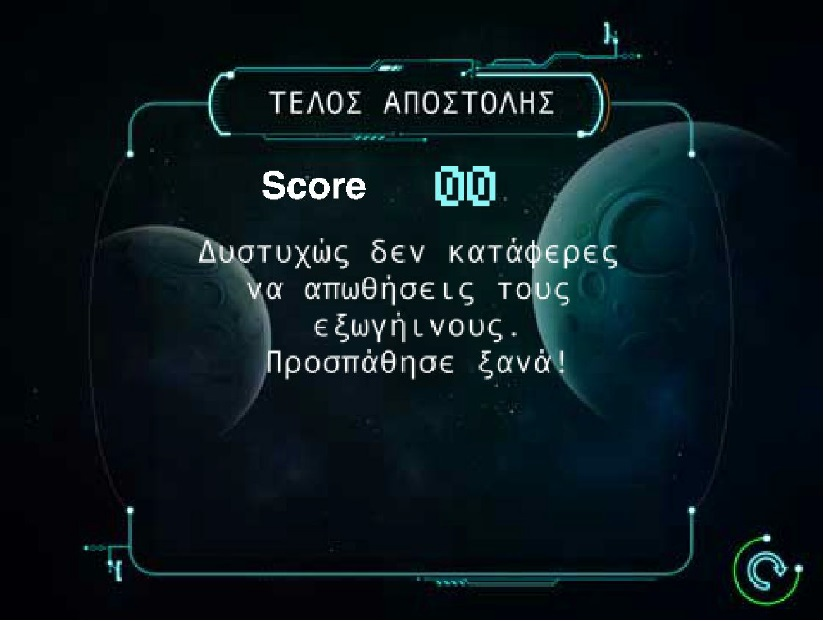

#ΙΟΝΙΟ ΠΑΝΕΠΙΣΤΗΜΙΟ 
#ΠΜΣ ΤΜΗΜΑΤΟΣ ΠΛΗΡΟΦΟΡΙΚΗΣ 
#ΜΑΘΗΜΑ: Σχεδίαση της Διάδρασης Ανθρώπου-Υπολογιστή 
 
Επιβλέπων καθηγητής: Χωριανόπουλος Κωνσταντίνος 

Φοιτητές: 

ΔΑΜΑΣΚΟΣ ΘΕΟΦΑΝΗΣ - ΠΜ201501 - c15dama@ionio.gr 

ΚΟΥΤΣΟΥΜΠΙΔΗΣ ΕΥΑΓΓΕΛΟΣ - ΠΜ201509 - c15kout@ionio.gr 

ΣΙΩΤΑΣ ΓΕΩΡΓΙΟΣ - ΠΜ201515 - c15siot@ionio.gr 

ΧΑΣΑΠΗΣ ΔΗΜΗΤΡΙΟΣ - ΠΜ201518 - c15chas@ionio.gr 

Κέρκυρα, 2015 

##Σύνοψη

Η διδασκαλία των μαθηματικών ανέκαθεν αποτελούσε το γονιμότερο έδαφος πειραματισμού για τον εκπαιδευτικό, με σκοπό την μετάδοση γνώσεων στο μαθητή με τον διεισδυτικότερο τρόπο. Στηριγμένοι στη συγκεκριμένη παράμετρο δημιουργήσαμε, με τη βοήθεια του λογισμικού Scratch, ένα εκπαιδευτικό [βιντεο-παιχνίδι](https://scratch.mit.edu/projects/91575909/)  για την ταχύτερη εξοικείωση των μαθητών στις τέσσερις βασικές πράξεις (πρόσθεση, αφαίρεση, πολλαπλασιασμός, διαίρεση) και αφού το εισαγάγαμε επανειλημμένως στην εκπαιδευτική πράξη (σχολική τάξη), συλλέξαμε τα σχόλια και τις παρατηρήσεις που κάθε φορά έκαναν οι μαθητές, βελτιώνοντας προοδευτικά το παιχνίδι μέχρι την οριστική του διαμόρφωση. Link για το παιχνίδι: https://scratch.mit.edu/projects/91575909/  

##Εισαγωγή 

##Περιγραφή gameplay του παιχνιδιού 

Το διαστημικό μας σκάφος έχει αποστολή την καταστροφή των αντίστοιχων εχθρικών. Τα εχθρικά σκάφη φέρουν πάνω τους μια από τις 4 βασικές πράξεις (πρόσθεση, αφαίρεση, πολλαπλασιασμός, διαίρεση). Η δυσκολία του παιχνιδιού αυξάνεται βαθμιαία ξεκινώντας από την πράξη της πρόσθεσης και επεκτείνεται στις υπόλοιπες. Το αποτέλεσμα της πράξης εμφανίζεται πάνω αριστερά σε ειδικό για το σκοπό αυτό πλαίσιο. Χρησιμοποιώντας τα πλήκτρα των κατευθύνσεων (δεξιά-αριστερά) και το πλήκτρο space κινούμε το σκάφος μας και πυροβολούμε αντίστοιχα τα εχθρικά διαστημόπλοια Κάθε φορά που γίνεται σωστή στόχευση στη σωστή πράξη το πλαίσιο με το αποτέλεσμα μας ενημερώνει με ένα πράσινο ν. Για κάθε λανθασμένη εμφανίζεται ένα κόκκινο x. Οι ζωές που έχουμε στη διάθεσή μας είναι συνολικά τρεις. Κάθε σωστή απάντηση, όμως, μπορεί να μας επιστρέψει πίσω μια χαμένη ζωή. Το κέρδος σε ζωές δεν μπορεί να είναι μεγαλύτερο από αυτό που ξεκινάει ο χρήστης το παιχνίδι, δηλαδή τρεις. Οι πίστες του παιχνιδιού έχουν διαφορετικό γραφικό περιβάλλον και κατά σειρά παρουσιάζουν τις πράξεις της πρόσθεσης της αφαίρεσης του πολλαπλασιασμού και της διαίρεσης. Το παιχνίδι ξεκινάει με μια αφήγηση μέσα σε ένα σχολικό περιβάλλον όπου ένας μαθητής, ο οποίος είναι και ο ήρωας του παιχνιδιού, κοιμάται την ώρα του μαθήματος. Το όνειρό του είναι και η αφορμή εκκίνησης του παιχνιδιού αφού βλέπει πως είναι αστροναύτης και ετοιμάζεται να σώσει τη γη με τις ικανότητές του στα μαθηματικά. Παίρνει το διαστημόπλοιο του και φεύγει να απωθήσει τα εχθρικά διαστημόπλοια Η ιστορία του ήρωά μας ολοκληρώνεται κατά τον τερματισμό του παιχνιδιού για να δοθεί το στοιχείο της έκπληξης, του ενθουσιασμού και της επιβράβευσης στο παιδί-χρήστη.

##Αφήγηση  

Η αφήγηση κατά την έναρξη του παιχνιδιού παίζει καταλυτικό ρόλο στην αντιμετώπιση του από το χρήστη. Σκοπός της είναι να δώσει κίνητρο με τη χρήση ενός ήρωα ως καθοδηγητή και ως μιας φυσιογνωμίας που θα εμπνεύσει. Στην προκειμένη περίπτωση, με τη χρήση του παιδιού- ήρωα στο Number Invaders Deluxe Edition, επιζητήσαμε την ταύτιση μέσα από μια χιουμοριστική σκοπιά: Ένας μαθητής κοιμάται την ώρα του μαθήματος και ονειρεύεται ένα διαστημικό περιβάλλον στο οποίο είναι πρωταγωνιστής και παίρνει τα ηνία για να σώσει τη γη. Στην προσπάθειά του αυτή θα χρησιμοποιήσει ως όπλο τις ικανότητές του στα μαθηματικά. Πρέπει, δηλαδή, να ξεπεράσει όποια πιθανή αδυναμία έχει και να προσπαθήσει να αφοσιωθεί στο στόχο του μέσα από το νοερό υπολογισμό των τεσσάρων πράξεων των μαθηματικών. Σημαντικό κρίνεται πως ο ήρωας δεν είναι απρόσωπος. Το όνομά του είναι Δημήτρης και είναι μαθητής σε δημοτικό σχολείο. Το γεγονός αυτό κάνει τους μικρούς χρήστες να θαυμάσουν έναν ήρωα που θα μπορούσε να είναι συμμαθητής τους και να τολμήσουν να πάρουν τη θέση του στο παιχνίδι. Η αφήγηση ολοκληρώνεται στον τερματισμό του παιχνιδιού όπου και εκεί κυριαρχεί το χιουμοριστικό στοιχείο. Τέλος, ο ήρωας δίνει ξεκάθαρα το μήνυμα της προσπάθειας για την επίτευξη των στόχων με το οποίο κλείνει και το παιχνίδι.

##Διαχείριση λάθους 

Ο εκπαιδευτικός χαρακτήρας του παιχνιδιού απαιτεί άμεση ανατροφοδότηση και διαχείριση των λανθασμένων επιλογών του χρήστη με τέτοιο τρόπο ώστε να επιτευχθεί, όσο γίνεται, το μέγιστο όφελος κατά τη διάδραση. Έπειτα από αρκετή σκέψη, συζήτηση και αποτυχημένες προσπάθειες, η ομάδα αποφάσισε πως η πιο πειστική, ως προς τα αποτελέσματά της, μέθοδος διαχείρισης λάθους δε θα ήταν μια απλή επίδειξη της σωστής απάντησης. Συμφωνήσαμε πως η επανάληψη της προσπάθειας των παικτών θα έδινε τη δυνατότητα να σκεφτούν το λάθος τους και να λάβουν και άλλη ευκαιρία για να διορθώσουν μόνοι τους την επιλογή τους. Για το λόγο αυτό, κάθε φορά που ο χρήστης στοχεύει, λανθασμένα, στο εχθρικό σκάφος με τη λάθος πράξη, το σκάφος καταστρέφεται και εκτοξεύει προς το μέρος του δικού μας σκάφους μια ακτίνα λέιζερ την οποία θα πρέπει να αποφύγουμε. Έτσι, έχουμε την ευκαιρία, αφού αποφύγουμε την ακτίνα, να στοχεύσουμε και πάλι στη σωστή κατεύθυνση. Με τις παραπάνω αλλαγές στη διαχείριση του λάθους οι ζωές δε χάνονται πλέον στοχεύοντας λανθασμένα αλλά στην περίπτωση που μας πετύχει το λέιζερ της λανθασμένης μας επιλογής.

##Προδιαγραφές Number Invaders Deluxe Edition 

##Σενάριο χρήσης 

Ο Δημήτρης είναι μαθητής της Γ΄ τάξης του Δημοτικού. Αν και έξυπνος και καλός μαθητής, δεν του αρέσει να ασχολείται με τις εργασίες για το σπίτι. Ο δάσκαλός του ο κ. Χατζής προσπαθεί να βρει έναν ευχάριστο τρόπο να τον ωθήσει να δουλέψει, δεδομένου ότι του λείπει η εξάσκηση στις τέσσερις πράξεις των μαθηματικών. Σκοπεύει να τον βοηθήσει να ξεπεράσει τη δυσκολία του στους νοερούς υπολογισμούς με το video game “number invaders deluxe edition”. Στο συγκεκριμένο βίντεο παιχνίδι ο μαθητής μπορεί να πετύχει τους επιθυμητούς στόχους σε ένα ευχάριστο διαστημικό περιβάλλον που έχει σκοπό να τον γοητεύσει και να του τραβήξει την προσοχή. Το “number invaders deluxe edition” περιέχει νοερούς υπολογισμούς για τις τέσσερις πράξεις αποτελώντας ένα χρήσιμο εργαλείο στη διδασκαλία του μαθήματος των μαθηματικών.

##Επιλογή εργαλείων 

Τα εργαλεία που χρησιμοποιήσαμε ήταν τα εξής: 
 
**MIT Scratch**: Αποτελεί το κύριο εργαλείο ανάπτυξης του βιντεο-παιχνιδιού. Το Scratch είναι ένα περιβάλλον προγραμματισμού στο οποίο οι χρήστες δημιουργούν προγράμματα με το σύρσιμο δομικών στοιχείων με ενέργειες, οι οποίες ανήκουν σε ένα αντικείμενο. Είναι σχετικά εύκολο στην εκμάθηση και την χρήση καθώς σχεδιάστηκε για νέους (ηλικίες 8 και επάνω). 
 
**Photoshop**: Το λογισμικό της εταιρείας Adobe αποτελεί ένα ιδιαίτερα εκτεταμένο και πολύπλοκο λογισμικό για την επεξεργασία εικόνων. Χρησιμοποιήσαμε το Photoshop για την επεξεργασία εικόνων και γραφικών και τα εισάγαμε αργότερα στο Scratch ως sprites, costumes και backdrops. 
  
**Corel Draw**: Αποτελεί λογισμικό σχεδιασμού. Χρησιμοποιήθηκε για την επεξεργασία και τη σχεδίαση των εικόνων της αρχικής όσο και της τελικής αφήγησης, οι οποίες παρουσιάζονται παρακάτω στο κεφάλαιο ενδεικτικές οθόνες.  
 
Επίσης να σημειώσουμε ότι προβήκαμε σε αγορά των γραφικών του παιχνιδιού από κατάλληλη [ιστοσελίδα](http://graphicriver.net/ ) . Τα γραφικά, σχεδιασμένα από επαγγελματία γραφίστα, έκανε το παιχνίδι πιο ελκυστικό στις μικρές ηλικίες στις οποίες και απευθύνεται. Τέλος όλα τα ηχητικά στοιχεία που χρησιμοποιήσαμε στο παιχνίδι είναι υπό άδεια Creative Commons. 

##Διαδικασία ανάπτυξης 

Η αρχική ιδέα και η ανάπτυξη ξεκίνησαν κατά την διάρκεια των διαλέξεων του μαθήματος “Σχεδίαση της Διάδρασης Ανθρώπου-Υπολογιστή”. Με βάση τη ροή των διαλέξεων, αλλά και τις συσκέψεις της ομάδας, όχι μόνο κατά τη διάρκεια των μαθημάτων, οριοθετήσαμε το βασικό προσανατολισμό τον οποίο διαρκώς βελτιώναμε στηριγμένοι στις παρατηρήσεις τόσο των εκπαιδευτών, των συμφοιτητών αλλά και των μικρών μαθητών, που επανειλημμένως κλήθηκαν να δοκιμάσουν την εφαρμογή, όσο και στη μελέτη της βιβλιογραφίας και του brainstorming των μελών της ομάδας κατά τη διάρκεια των μεταξύ μας συσκέψεων. 
 
Το gameplay του παιχνιδιού βασίστηκε στο αντίστοιχο του κλασσικού arcade παιχνιδιού: [Space invaders](https://en.wikipedia.org/wiki/Space_Invaders) καθώς θεωρήσαμε ασφαλή επιλογή να ανατρέξουμε σε ένα οικείο προς αυτούς βιντεοπαιχνίδι Επίσης βασιστήκαμε σε προϋπάρχοντα εκπαιδευτικά παιχνίδια και συγκεκριμένα στο [Number Invaders](http://www.mathplayground.com/balloon_invaders_addsub.html ) και [Αlien Addition](http://www.mathplayground.com/ASB_AlienAddition.html). Το αρχικό πρωτότυπο μεσαίας πιστότητας που σχεδιάσαμε στο εργαλείο Photoshop, ενθυλακώνει την πρώτη ιδέα του παιχνιδιού δανείζοντας στοιχεία από προϋπάρχοντα παιχνίδια παρουσιάζεται εδώ:

Πρώτο πρότυπο μεσαίας πιστότητας.

Δεύτερο πρότυπο υψηλής πιστότητας.

Ύστερα προχωρήσαμε στην ανάπτυξη του παιχνιδιού χρησιμοποιώντας την πλατφόρμα Scratch και βελτιώνοντας διάφορα στοιχεία μέσα από πολλαπλές επαναλήψεις. Δανειστήκαμε στοιχεία (κώδικα και ιδέες) από τα εξής παιχνίδια: https://scratch.mit.edu/projects/1979494/, https://scratch.mit.edu/projects/70546464/ και https://scratch.mit.edu/projects/2257739/. Οι ενδεικτικές οθόνες παρατίθενται παρακάτω.

##Δοκιμαστική εφαρμογή του «number invaders deluxe edition» σε σχολική τάξη 

Για να βεβαιωθεί η ομάδα εργασίας πως κινείται στη σωστή κατεύθυνση για τη δημιουργία ενός επιτυχημένου εκπαιδευτικού video game αποφάσισε να δοκιμάσει το «number invaders deluxe edition» στο κοινό που απευθύνεται: σε μαθητές δημοτικού σχολείου. Θεωρήθηκε πως το feedback που θα δώσουν οι μαθητές­ χρήστες θα αποφέρει χρήσιμα συμπεράσματα για παραλείψεις, λάθη και μελλοντικές βελτιώσεις. Μέσα από ένα δείγμα 30 περίπου μαθητών από δύο δημοτικά σχολεία και από τις τάξεις Γ΄ και Δ΄ λάβαμε πολλά και ποικίλα σχόλια για το παιχνίδι το οποίο αφορά στις 4 πράξεις των μαθηματικών. 
 
Το σενάριο και οι αρχικές οθόνες του video game έκαναν τα παιδιά να χαμογελάσουν και να ταυτιστούν, κατά κάποιο τρόπο, με τον ονειροπόλο ήρωα. Υπήρξαν κολακευτικά σχόλια για τα γραφικά και το περιβάλλον του «N.I.D.E.». Χαρακτηριστικά αναφέρουμε πως όταν τους ανακοινώθηκε πως θα παίξουν ένα παιχνίδι πράξεων, οι προσδοκίες τους ήταν πολύ μικρότερες καθώς δεν περίμεναν πως το παιχνίδι θα βασίζεται σε game play πραγματικού παιχνιδιού. Δεν έλειψαν, λοιπόν, οι μαθητές οι οποίοι δυσανασχέτησαν αρχικά και έδειξαν να μην ενδιαφέρονται να πλησιάσουν τον υπολογιστή. Η πρώτη επαφή, όμως, και ως παίκτες αλλά και ως παρατηρητές έκανε τους περισσότερους να αλλάξουν γνώμη και ζήτησαν να πάρουν με προθυμία μέρος στη δοκιμαστική εφαρμογή του. 
 
Σχολιάστηκε θετικά το γεγονός πως το παιχνίδι έχει απλό χειρισμό και είναι πολύ προσιτό στις περισσότερες τάξεις του δημοτικού. Η κλιμακούμενη δυσκολία του ξεκινώντας από την πράξη της πρόσθεσης βοήθησε τους πιο αδύναμους μαθητές χωρίς απογοητεύσεις Άλλο ένα θετικό σημείο που τονίστηκε από τους μαθητές ήταν πως θα τους άρεσε πολύ να μπορούσαν να κάνουν εξάσκηση στους νοερούς υπολογισμούς των τεσσάρων πράξεων με το «N.I.D.E.» στο σπίτι. Επιπλέον, ο στόχος κατάκτησης των πιστών αλλά και του τερματισμού οπλίζει με πείσμα, όπως μας είπαν οι ίδιοι, και τους βάζει σε διαδικασία να προσπαθούν να κάνουν πιο γρήγορα και σωστά τις πράξεις. Στο στόχο αυτό βοήθησε ιδιαίτερα το ότι με κάθε σωστή βολή μπορούσαν να ανακτήσουν την ζωή που έχασαν από κάποια λανθασμένη παρατείνοντας έτσι τη συμμετοχή τους. Επίσης, να αναφέρουμε πως συμφώνησαν ότι θα ήταν ο ιδανικός τρόπος αξιολόγησής τους στο κομμάτι αυτό των μαθηματικών και θα ήθελαν να βλέπουν συχνότερα πραγματικά παιχνίδια με εκπαιδευτικό χαρακτήρα, μακριά από βαρετά λογισμικά και τετριμμένες πρακτικές. 
 
Όσον αφορά τα σχόλια βελτιώσεων και παραλείψεων των μαθητών για το «N.I.D.E.» επικεντρώθηκαν κυρίως στον αριθμό των πιστών του. Μας είπαν πως θα επιθυμούσαν να υπάρχει στο τέλος μια πίστα με μπερδεμένες τις 4 πράξεις. Εξέφρασαν επίσης την επιθυμία να διαρκεί περισσότερο και πρότειναν να μπουν περισσότερες πράξεις σε κάθε πίστα ή να δημιουργηθούν περισσότερες πίστες. Άλλη μια αδυναμία που εντοπίστηκε από τα παιδιά ήταν η ξαφνική αλλαγή των πιστών καθώς δε γινόταν αυτή εύκολα αντιληπτή με αποτέλεσμα να μην παρατηρούν πως άλλαζε και το είδος της πράξης. Αυτό είχε ως συνέπεια να στοχεύουν λανθασμένα μερικές φορές την πρώτη πράξη της επόμενης πίστας. Τέλος, λαμβάνοντας υπόψη την ανάγκη για καλύτερη διαχείριση του λάθους από το παιχνίδι και παρατηρώντας τους μαθητές κατά τη διάδραση, αποφασίστηκε να γίνεται όπως προαναφέρθηκε στο κεφάλαιο “διαχείριση λάθους”. Η τροποποίηση αυτή σε συνδυασμό με μικροεπεμβάσεις πάνω στις άλλες παρατηρήσεις των παιδιών βελτίωσαν σημαντικά την εμπειρία του game play του «number invaders deluxe edition». 

##Ενδεικτικές Οθόνες  

Αρχική αφήγηση που παρουσιάζει την ιστορία (1/2)

Αρχική αφήγηση που παρουσιάζει την ιστορία - Η αρχή του ταξιδιού… (2/2) 

Οθόνη έναρξης του παιχνιδιού. 

Οθόνη επιλογής επιπέδου (level) δυσκολίας-πράξης. 

Οθόνη gameplay με την πράξη της πρόσθεσης. 

Οθόνη σε περίπτωση σωστού αποτελέσματος. 

Οθόνη σε περίπτωση λανθασμένου αποτελέσματος. 

Επεξηγηματική οθόνη στην αρχή του παιχνιδιού. 

Οθόνη game over σε περίπτωση λάθους 

Τελική αφήγηση σε περίπτωση επιτυχούς ολοκλήρωσης του παιχνιδιού 

## Συμπεράσματα και προτάσεις για μελλοντικές βελτιώσεις 

##Συμπεράσματα 

Το Space Invaders Deluxe Edition είναι ένα βιντεοπαιχνίδι απόλυτα εναρμονισμένο με το πρόγραμμα σπουδών του Υπουργείου Παιδείας και πληροί τις προϋποθέσεις ως υποστηρικτικό υλικό για την ταχύτερη κατανόηση και εμβάθυνση του μαθητή στις βασικές μαθηματικές πράξεις. Το γεγονός αυτό επαληθεύεται και από την ανατροφοδότηση που λάβαμε, μέσω των αλλεπάλληλων εφαρμογών του στην τάξη για τη διεξαγωγή ασφαλέστερων συμπερασμάτων.

##Βελτιώσεις 

Οι πιθανές βελτιώσεις αναφορικά με την εργασία προσανατολίζονται στο συνδυασμό πράξεων στις υψηλότερες πίστες ή ακόμα και την επιτέλεση πολυπλοκότερων πράξεων για τις ανάγκες των μεγαλύτερων ηλικιακά παιδιών. Μία ακόμα προοπτική είναι η επέκταση του παιχνιδιού με φόντο την κάλυψη των αναγκών και άλλων μαθημάτων (φυσική, γεωγραφία κτλ.) όπως και η κατασκευή εξωτερικού χειριστηρίου (στο theme του παιχνιδιού ­ διαστημόπλοιο, εξωγήινοι κτλ.) για να καταστεί ελκυστικότερο από το μαθητή. Στην ίδια φιλοσοφία μια ενδιαφέρουσα αναβάθμιση θα ήταν η προοπτική του Multiplayer gaming με την προσθήκη ενός δεύτερου διαστημόπλοιου που θα ανέβαζε συνακόλουθα και τον υγιή ανταγωνισμό μεταξύ των μαθητών. Τέλος στην τελευταία πίστα οι αντίπαλοι (εξωγήινοι) μπορούν να εξοπλιστούν με extra skills και να πυροβολούν ταυτόχρονα το διαστημόπλοιο του χρήστη / μαθητή, ώστε να τον θέσει άμεσα σε εγρήγορση.

## Βιβλιογραφικές Πηγές 

*	Chorianopoulos, Konstantinos, and Michail N. Giannakos. "Design Principles for Serious Video Games in Mathematics Education: From Theory to Practice." The International Journal of Serious Games 1.3 (2014). 
*	Kafai, Yasmin B., and Veena Vasudevan. "Constructionist Gaming Beyond the Screen: Middle School Students' Crafting and Computing of Touchpads, Board Games, and Controllers." Proceedings of the Workshop in Primary and Secondary Computing Education on ZZZ. ACM, 2015. 
*	Vogler, C., The writer’s journey: Mythic structures for writers. Studio City, CA: Michael Wiese Productions, 1998 
*	Campbell, J., The hero's journey: Joseph Campbell on his life and work (Vol. 7). New World Library, 2003 
*	Crawford, C. The Art of Computer Game Design, McGraw Hill Osborne Media, 1984 

