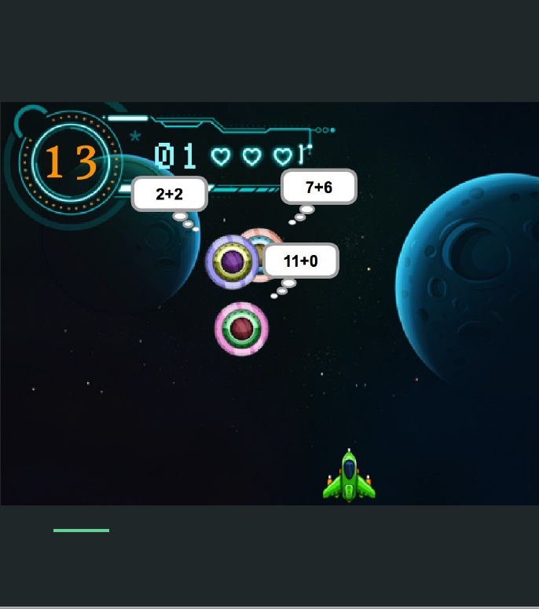
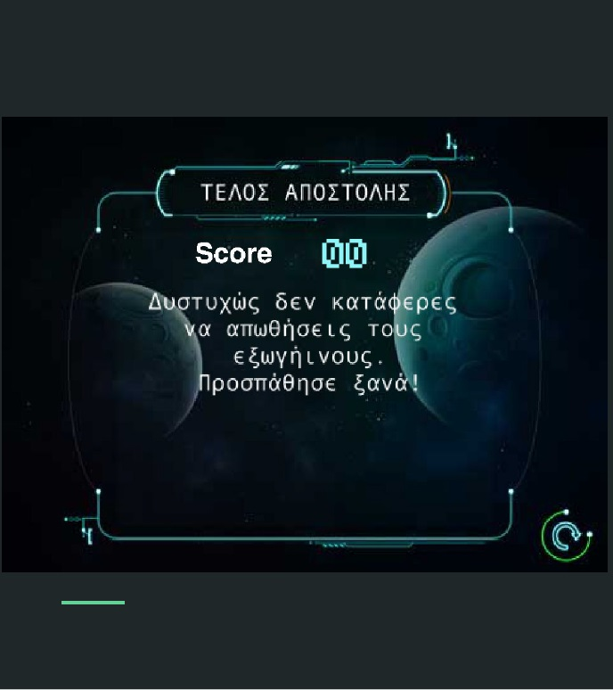

#ΙΟΝΙΟ ΠΑΝΕΠΙΣΤΗΜΙΟ 
#ΠΜΣ ΤΜΗΜΑΤΟΣ ΠΛΗΡΟΦΟΡΙΚΗΣ 
#ΜΑΘΗΜΑ: Σχεδίαση της Διάδρασης Ανθρώπου-Υπολογιστή 
 
Επιβλέπων καθηγητής: Χωριανόπουλος Κωνσταντίνος 

Φοιτητές: 

ΔΑΜΑΣΚΟΣ ΘΕΟΦΑΝΗΣ - ΠΜ201501 - c15dama@ionio.gr 

ΚΟΥΤΣΟΥΜΠΙΔΗΣ ΕΥΑΓΓΕΛΟΣ - ΠΜ201509 - c15kout@ionio.gr 

ΣΙΩΤΑΣ ΓΕΩΡΓΙΟΣ - ΠΜ201515 - c15siot@ionio.gr 

ΧΑΣΑΠΗΣ ΔΗΜΗΤΡΙΟΣ - ΠΜ201518 - c15chas@ionio.gr 

##Προδιαγραφές

* Άνθρωπος
* Πλαίσιο χρήσης
* Σκοπός
* Διεργασία χρήσης
* Λόγοι επιτυχίας ή αποτυχίας εφαρμογών

## Εγκατάσταση εργαλείων ανάπτυξης και τρέξιμο/αλλαγές σε υπάρχοντα

*	Εργαλείο ανάπτυξης: Scratch
* Δανεισμός στοιχείων (ιδέες και κώδικα) από: https://scratch.mit.edu/projects/1979494/ και: https://scratch.mit.edu/projects/70546464/

http://www.mathplayground.com/balloon_invaders_addsub.html

http://www.mathplayground.com/ASB_AlienAddition.html

Πρωτότυπο 1

Πρωτότυπο 2

Οθόνη 1-Αρχική οθόνη

Οθόνη 2-Επιλογή πίστας - πράξης

Οθόνη 3-In-game

Οθόνη 4.1-Σωστό

Οθόνη 4.2-Λάθος

Οθόνη 5-Οδηγίες

Οθόνη 6- Game Over

Αρχική αφήγηση

Αφήγηση - Σενάριο ολοκλήρωσης παιχνιδιού

##Σενάριο 

* Κωνσταντίνος είναι μαθητής της Γ΄ τάξης του Δημοτικού. Αν και έξυπνος και καλός μαθητής, δεν του αρέσει να ασχολείται με τις εργασίες για το σπίτι. 
* Ο δάσκαλός του ο κ. Χατζής προσπαθεί να βρει έναν ευχάριστο τρόπο να τον ωθήσει να δουλέψει, δεδομένου ότι του λείπει η εξάσκηση στις τέσσερις πράξεις των μαθηματικών. 
* Σκοπεύει να τον βοηθήσει να ξεπεράσει τη δυσκολία του στους νοερούς υπολογισμούς με το video game “number invaders deluxe edition”. 
* Στο συγκεκριμένο βίντεο παιχνίδι ο μαθητής μπορεί να πετύχει τους επιθυμητούς στόχους σε ένα ευχάριστο διαστημικό περιβάλλον που έχει σκοπό να τον γοητεύσει και να του τραβήξει την προσοχή. Το “number invaders deluxe edition” περιέχει νοερούς υπολογισμούς για τις τέσσερις πράξεις αποτελώντας ένα χρήσιμο εργαλείο στη διδασκαλία του μαθήματος των μαθηματικών.

## Game:https://scratch.mit.edu/projects/91575909/

